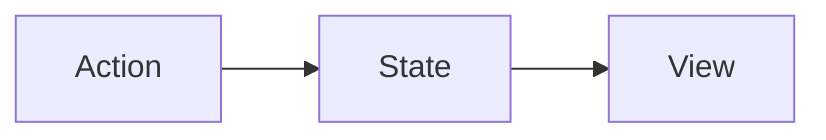

# ImmutableData-Legacy 0.3.0

[](https://github.com/Swift-ImmutableData/ImmutableData-Legacy/actions/workflows/builds.yml)
[](https://github.com/Swift-ImmutableData/ImmutableData-Legacy/actions/workflows/tests.yml)

Easy State Management for Legacy SwiftUI Apps

## Background

Drawing on over a decade of experience shipping products at scale using declarative UI frameworks, we present a new application architecture for SwiftUI. Using the Flux and Redux architectures as a philosophical prior art, we can design an architecture using modern Swift and specialized for modern SwiftUI. This architecture encourages *declarative* thinking instead of *imperative* thinking, *functional* programming instead of object-oriented programming, and *immutable* model values instead of mutable model objects.

At the core of the architecture is a unidirectional data flow:



All global state data flows through the application following this basic pattern, and a strict separation of concerns is enforced. The actions *declare* what has occurred, whether user input, a server response, or a change in a device’s sensors, but they have no knowledge of the state or view layers. The state layer *reacts* to the “news” described by the action and updates the state accordingly. All logic for making changes to the state is contained within the state layer, but it knows nothing of the view layer. The views then *react* to the changes in the state layer as the new state flows through the component tree. Again, however, the view layer knows nothing about the state layer. By maintaining this strict unidirectional data flow and separation of concerns, our application code becomes easier to test, easier to reason about, easier to explain to new team members, and easier to update when new features are required.

Further, avoiding complexity like two-way data bindings, or the spaghetti engendered by mutability, allows our code to become clean, fast, and maintainable. This is the key difference between this application framework (and the ideas behind it) and other presentations of actions, state, and view previously shown at WWDC.[^1] By avoiding direct mutations called from outside the state layer and embracing immutability instead, complexity vanishes and our code becomes much more robust.

[*The ImmutableData Programming Guide*](https://github.com/Swift-ImmutableData/ImmutableData-Book) is the definitive reference for learning `ImmutableData`.

## Support for Legacy Platforms

`ImmutableData-Legacy` is a subset of the functionality in our original `ImmutableData` project. Some of the changes — like migrating from `Observable` to `Combine` when notifying components that Selector Outputs have changed — are implementation details that should not affect how product engineers build components. The biggest change to our *interface* — the `public` API that product engineers need — is that Selectors only accept single Dependency Selectors. We do not support variadic types in this version of our infra.

## Requirements

The `ImmutableData-Legacy` infra deploys to the following platforms:
* iOS 13.0+
* iPadOS 13.0+
* macOS 10.15+
* tvOS 13.0+
* visionOS 1.0+
* watchOS 6.0+

Building the `ImmutableData-Legacy` package requires Xcode 16.0+ and macOS 14.5+.

Please file a GitHub issue if you encounter any compatibility problems.

## Usage

The `ImmutableData` package makes three library modules available to your products:

* `ImmutableData`: This is the “data” infra. This module builds the basic types for managing the data models of your global application state.
* `ImmutableUI`: This is the “UI” infra. This module builds the basic types for displaying and transforming global application state in your SwiftUI component graph.
* `AsyncSequenceTestUtils`: This module helps us write predictable and deterministic tests for certain asynchronous operations. This is *not* intended to ship as a dependency in your production code — this is *only* intended for test code.

*The ImmutableData Programming Guide* presents complete sample application product tutorials. This is the recommended way to learn how to build products with `ImmutableData`.

A very basic “Hello World” application would be a Counter: a SwiftUI application to increment and decrement an integer value.

We begin with the data models of our Counter application:

```swift
typealias CounterState = Int

enum CounterAction {
  case didTapIncrementButton
  case didTapDecrementButton
}

enum CounterReducer {
  @Sendable static func reduce(
    state: CounterState,
    action: CounterAction
  ) -> CounterState {
    switch action {
    case .didTapIncrementButton:
      state + 1
    case .didTapDecrementButton:
      state - 1
    }
  }
}
```

We define an `EnvironmentKey` value that will save an instance of `ImmutableData.Store`:

```swift
import ImmutableData
import ImmutableUI
import SwiftUI

@MainActor struct StoreKey: @preconcurrency EnvironmentKey {
  static let defaultValue = ImmutableData.Store<CounterState, CounterAction>(
    initialState: 0,
    reducer: { state, action in
      fatalError("missing store")
    }
  )
}

extension EnvironmentValues {
  var store: ImmutableData.Store<CounterState, CounterAction> {
    get {
      self[StoreKey.self]
    }
    set {
      self[StoreKey.self] = newValue
    }
  }
}
```

The `defaultValue` returned by `StoreKey` is constructed with a reducer that crashes to indicate programmer error: our component graph should use stores that were explicitly passed to the environment.

We can now construct a SwiftUI `App`:

```swift
@main
@MainActor struct CounterApp {
  @State var store = ImmutableData.Store(
    initialState: 0,
    reducer: CounterReducer.reduce
  )
}

extension CounterApp: App {
  var body: some Scene {
    WindowGroup {
      ImmutableUI.Provider(
        \.store,
        self.store
      ) {
        CounterContent()
      }
    }
  }
}
```

Here is our `CounterContent` for displaying and transforming global application state:

```swift
@MainActor struct CounterContent {
  @ImmutableUI.Selector(
    \.store,
    outputSelector: OutputSelector(
      select: { $0 },
      didChange: { $0 != $1 }
    )
  ) var value

  @ImmutableUI.Dispatcher(\.store) var dispatcher
}

extension CounterContent: View {
  var body: some View {
    VStack {
      Button("Increment") {
        self.didTapIncrementButton()
      }
      Text("Value: \(self.value)")
      Button("Decrement") {
        self.didTapDecrementButton()
      }
    }
  }
}
```

Here are the two action values that can be dispatched:

```swift
extension CounterContent {
  func didTapIncrementButton() {
    do {
      try self.dispatcher.dispatch(action: .didTapIncrementButton)
    } catch {
      print(error)
    }
  }
}

extension CounterContent {
  func didTapDecrementButton() {
    do {
      try self.dispatcher.dispatch(action: .didTapDecrementButton)
    } catch {
      print(error)
    }
  }
}
```

## SwiftUI Sample Apps

The `Samples/Samples.xcworkspace` workspace contains three sample application products built from the `ImmutableData` infra. These products are discussed in *The ImmutableData Programming Guide*.

## License

Copyright 2024 Rick van Voorden and Bill Fisher

Licensed under the Apache License, Version 2.0 (the "License"); you may not use this file except in compliance with the License. You may obtain a copy of the License at

    http://www.apache.org/licenses/LICENSE-2.0

Unless required by applicable law or agreed to in writing, software distributed under the License is distributed on an "AS IS" BASIS, WITHOUT WARRANTIES OR CONDITIONS OF ANY KIND, either express or implied. See the License for the specific language governing permissions and limitations under the License.

[^1]: https://developer.apple.com/videos/play/wwdc2019/226
